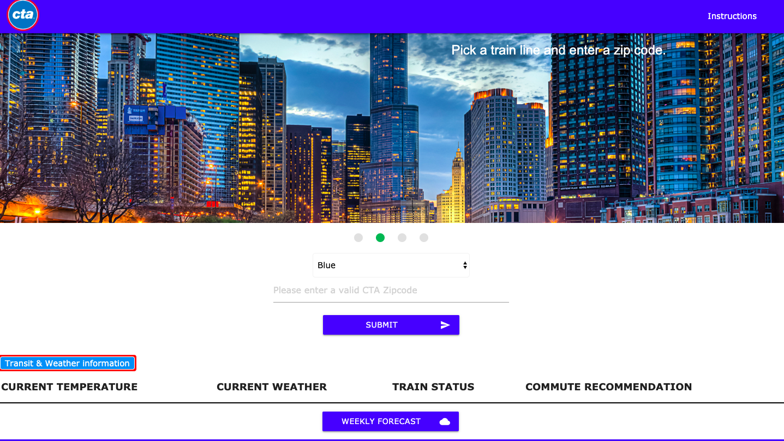

# ChicagoCommuteCheckerApp

[Chicago Commute Checker](https://chicagocommutechecker.github.io/ChicagoCommuteCheckerApp/)

We created a Web Application to help Chicago commuters figure out what their commute will look like.

This project utilized three different APIs: Current Weather Data, 5 Day Forecast, & CTA Customer Alerts

How our App works

1. Select your train line.

2. Pick your train station.

3. Relax! We're processing your commute conditions.

4. The app will show you the current weather conditions & real-time CTA alerts for your commute!

5. Click on the "Weekly Forecast" button to view weather conditions through the next 5 days.

## Authors

* **William Oakley** - *Collaborator* - https://github.com/woaky1
* **Alojzy Klim** - *Collaborator* - https://github.com/A-Klim01
* **Jordan Ricarte** - *Collaborator* - https://github.com/jricarte

## Built With

HTML5 
CSS3 
Javascript 
API's 